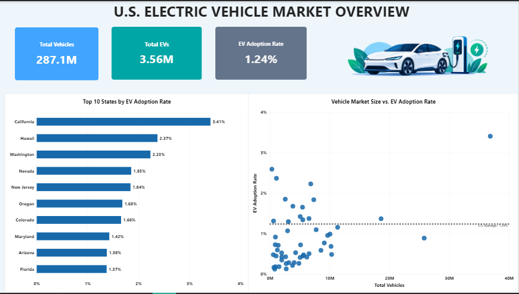
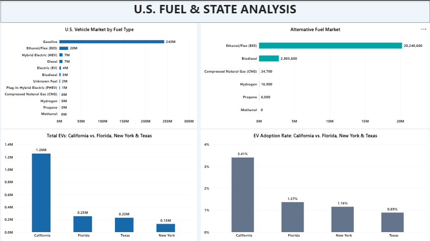

# US-EV-Market-Analysis
Analysis of U.S. vehicle registration data to evaluate EV adoption, fuel-market composition, state-level differences, and policy implications using Excel, SQL, and Power BI.

## Project Overview

This independent data analytics project analyzes U.S. vehicle registration data across different fuel types, with a focus on electric vehicle (EV) adoption across states.

The purpose of the project was to practice taking a real-world dataset through the complete analytics workflow: data cleaning, validation, SQL analysis, Power BI visualization, insight generation, and recommendations.

## Business Context

The analysis was designed to help the U.S. Transportation Board understand differences in EV adoption across states and use those insights to inform long-term strategies for increasing EV adoption in states where adoption is lower.

## Objectives

The project objectives were to:

- Understanding the structure and contents of the vehicle-registration dataset.
- Comparing EV adoption rates across states.
- Comparing vehicle-market composition by fuel type.
- Identifying states with higher and lower EV adoption.
- Examining alternative-fuel vehicle categories.
- Comparing California with other large states: Texas, Florida, and New York.
- Translating the analysis into dashboard insights and recommendations.

## Dataset

The dataset contains:

- **51 records** — 50 U.S. states plus the District of Columbia.
- **13 columns** — location plus 12 vehicle/fuel categories.
- Each row represents a state or the District of Columbia and its vehicle counts across fuel types.

The dataset allows analysis of EV adoption rates, vehicle-market size, fuel composition, EV counts, and alternative-fuel presence.

## Tools

- Microsoft Excel
- MySQL
- SQL
- Power Query
- Power BI
- DAX

## Methodology

### 1. Excel — Data Preparation & Validation

The dataset was cleaned and validated in Excel. Checks included:

- Inconsistent data formatting
- Missing values
- Text and number formatting
- Duplicate records
- Suspicious or unexpected totals
- Numeric data types
- Consistency of state names

No missing values or duplicate state records were identified.

### 2. MySQL / SQL — Validation & Analysis

The cleaned dataset was imported into MySQL.

SQL was used to:

- Validate the number of records.
- Verify the state list.
- Check for duplicate records.
- Check for NULL values.
- Validate national fuel totals.
- Calculate total vehicles by state.
- Calculate and rank EV adoption rates.
- Calculate PHEV, HEV, and gasoline market shares.
- Compare alternative-fuel categories.
- Compare California with Florida, Texas, and New York.

A **1% EV adoption rate** was also used as an analytical screening threshold. This was a project-specific analytical threshold, not an official government benchmark.

### 3. Power BI — Transformation, Modeling & Visualization

The MySQL data was connected to Power BI Desktop.

Power Query was used to create a reference table called **Fuel Analysis** and unpivot the fuel columns into:

- Fuel Type
- Vehicle Count

A one-to-many relationship was established between the state-level vehicle table and the Fuel Analysis table.

DAX measures were created for:

- Total Vehicles
- Total EVs
- EV Adoption Rate
- EV Adoption Rank
- Total Alternative Fuel Vehicles

## Dashboard

### Page 1 — U.S. Electric Vehicle Market Overview

The first dashboard page contains:

- Total Vehicles KPI
- Total EVs KPI
- EV Adoption Rate KPI
- Top 10 states by EV adoption rate
- Vehicle Market Size vs. EV Adoption Rate scatter chart
- U.S. average EV adoption reference line

### Page 2 — U.S. Fuel & State Analysis

The second dashboard page contains:

- U.S. Vehicle Market by Fuel Type
- Alternative Fuel Market
- Total EVs: California vs. Florida, New York & Texas
- EV Adoption Rate: California vs. Florida, New York & Texas

## Key Findings

### 1. California has the highest EV adoption among the states analyzed

California recorded an EV adoption rate of **3.41%**, compared with:

| State | EV Adoption Rate |
|---|---:|
| California | 3.41% |
| Florida | 1.37% |
| New York | 1.16% |
| Texas | 0.89% |

California therefore provides a useful benchmark for further investigation.

### 2. Gasoline remains overwhelmingly dominant

The dataset contains approximately **242.87 million gasoline vehicles**, compared with approximately **3.56 million EVs**.

The U.S. vehicle market therefore remains heavily dependent on gasoline, highlighting the scale of the transition required for EV adoption to grow substantially.

### 3. Ethanol/Flex is the largest alternative-fuel category

Ethanol/Flex (E85) accounts for approximately **20.24 million vehicles**, substantially more than the other alternative-fuel categories analyzed.

## Recommendations

- Develop a phased, long-term EV transition strategy with measurable adoption targets and periodic assessments.
- Use state-level EV adoption rates to identify states requiring further investigation and targeted support.
- Investigate factors limiting EV adoption in low-adoption states before designing targeted interventions.
- Study California's policies, infrastructure, incentives, and market conditions and assess which approaches could potentially be adapted elsewhere.
- Consider existing alternative-fuel adoption patterns when developing a broader transportation transition strategy, while maintaining EVs as a key long-term focus.

## Limitations & Data Gaps

This analysis is primarily based on vehicle-registration data.

The dataset can identify differences in EV adoption and vehicle-market composition, but it does **not** establish the causes of those differences or determine specific charging-infrastructure requirements.

Additional data on areas such as:

- Charging infrastructure
- Incentives
- Vehicle affordability
- Consumer behavior
- Other market factors

would strengthen future analysis.

## Project Workflow

**Excel → MySQL/SQL → Power BI → Findings → Recommendations**

| Stage | Purpose |
|---|---|
| Excel | Data cleaning and initial validation |
| MySQL / SQL | Data validation, calculations, comparisons, and analysis |
| Power BI | Data transformation, modeling, visualization, and dashboard development |
| Analysis | Findings and interpretation |
| Recommendations | Data-driven implications for decision-makers |

## Project Takeaways

- Counts and rates answer different questions.
- A strong analyst separates observations from hypotheses and causal conclusions.
- A dataset can identify patterns without explaining the reasons behind those patterns.
- Recommendations should be grounded in what the available evidence can support.
- Good analysis is not only about producing a dashboard; it is about moving from data to evidence, interpretation, and decision support.
